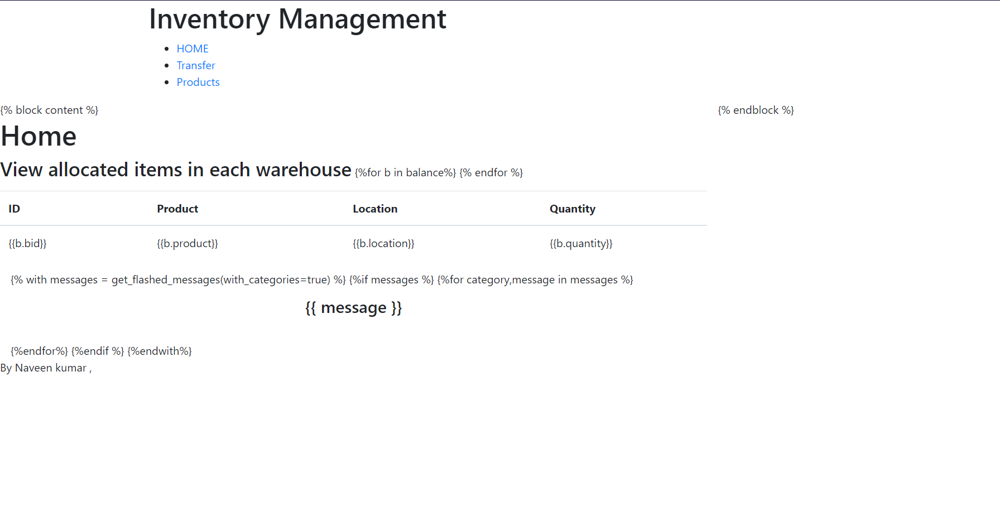
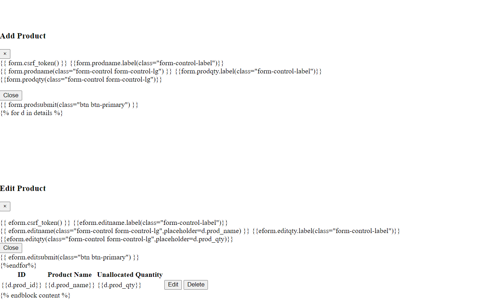
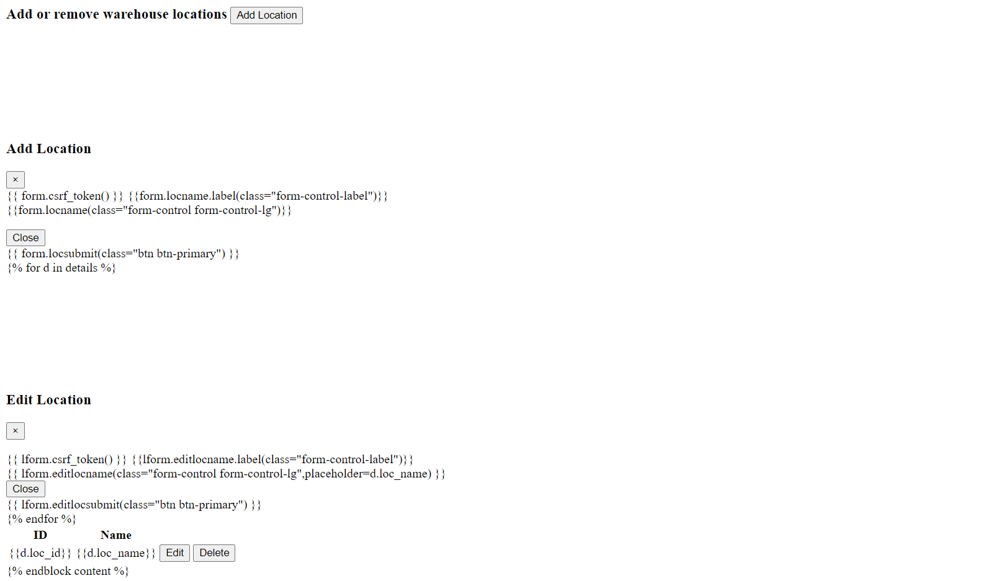

# Flask-Hiring-Test

I have just developed a simple inventory management application with my basic knowledge in Flask

## Getting Started

### Prerequisites

To create this webpage i have used:

- Python 3 [Pycharm]
- Flask
- SQLALCHEMY
- WTForms

## Project summaray
  This project is for manage inventory of a product list. I tried to develop a three main modules *Home*,*Product*,*Location*. **Home** module is overview of product transactions and then **product** and **location** for adding and editing the product to be send and where it to be send. 

## Running the app

## Adding and deleting the products

## For transfer adding and editing locations

